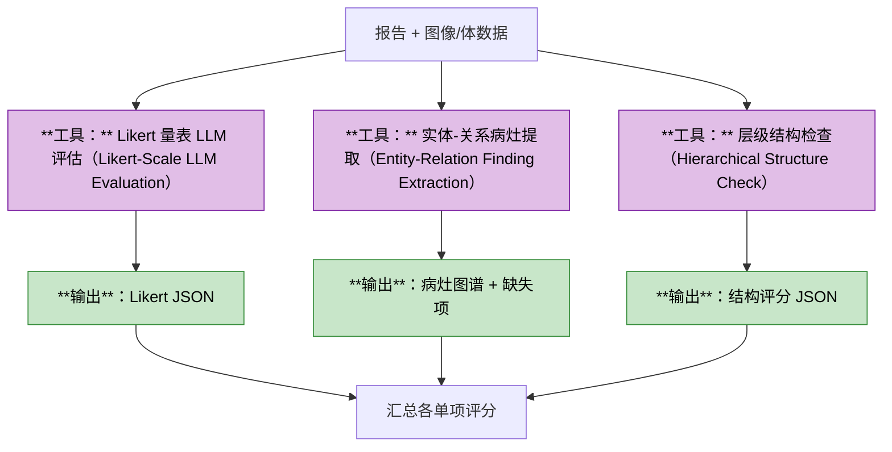
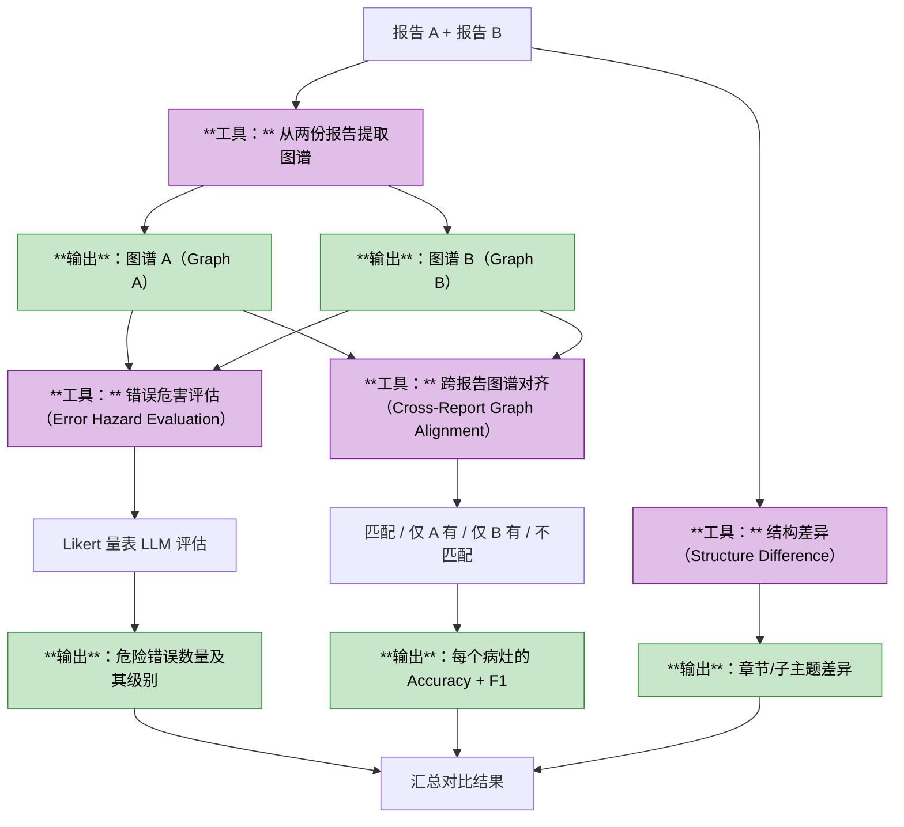
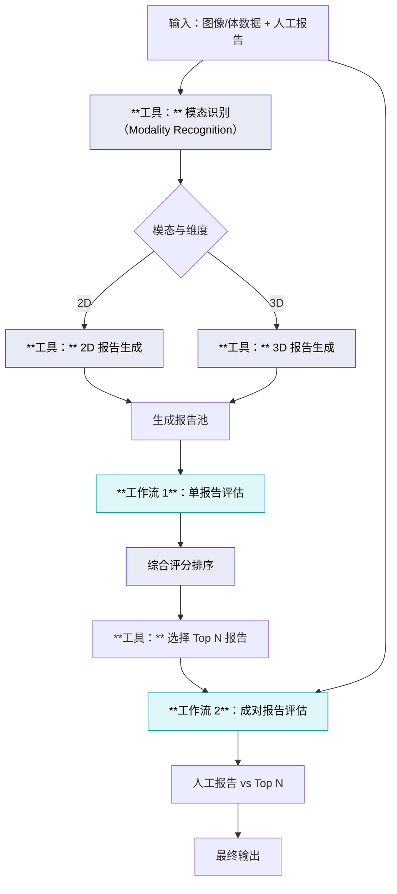
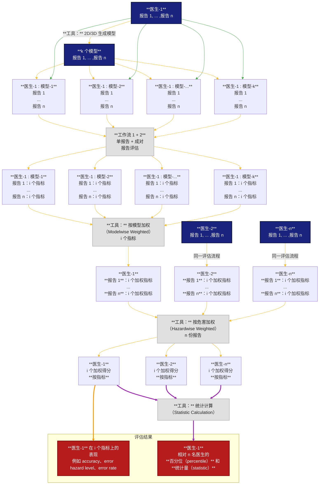
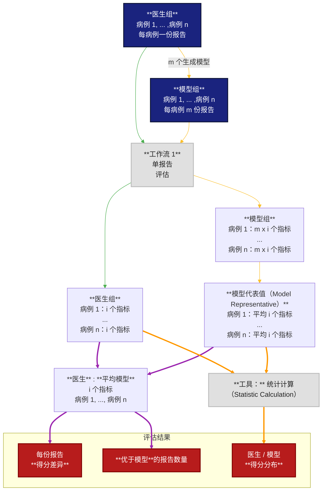

# 多 AI 模型放射科报告评估（Radiology Report Evaluation with Multiple AI Models）
本文概述目标与关键流程。

# 目标
## 主目标
- 评估输入的自由文本放射科报告（free text radiology report）
- 输出定量评估（quantitative evaluation）和定性评估（qualitative assessment）

## 子目标
- 使用固定的传统工具作为基线评估
- 使用 AI 模型生成的放射科报告作为主要评估和对比参考

# 通用规则
- 通过 CLI API 使用
- AI 模型包括本地推理（local inference）和云 API 调用（cloud API call）
- 若存在多个配置文件，所有配置放在同一目录；除非模块明确要求，不做硬编码
- 流程相同时尽量复用函数
- 关键步骤添加 `logging.debug`，便于调试
- 默认云端 LLM 应可通过配置调整
- 模块间共享的 API KEY 或通用配置应集中存放

# 模块与工作流工具
阅读 `tools.md`

# 主模块
## 模块 1：单报告评估（Single Report Evaluation）
描述：在没有参考报告的情况下评估自由文本报告。

输入：
- 输入自由文本报告（单文件，用于评估）
- 输入医学图像/体数据（单文件，与输入报告对应）

流程：

## 模块 2：成对报告评估（Pairwise Report Evaluation）
描述：将自由文本报告与参考报告对比评估。

输入：
- 输入自由文本报告（单文件，用于评估）
- 输入医学图像/体数据（单文件，与输入报告对应）
- 参考自由文本报告（单文件，用作参考）

流程：

# 集成工作流
## 工作流 1：
描述：评估一份随机人工撰写的自由文本报告。

输入：
- 输入自由文本报告（单文件，用于评估）
- 输入医学图像/体数据（单文件，与输入报告对应）

流程：

## 工作流 2：
描述：评估多名放射科医生的批量自由文本报告，并将每名医生的整体表现与所有 AI 模型及本科室整体水平进行比较（同一批次内）。

输入：
- 带唯一放射科医生 ID 的批量自由文本报告（Excel 文件，包含报告路径、对应图像/体数据路径、对应放射科医生唯一 ID；共 3 列，按名称匹配）

流程：

## 工作流 3：
描述：评估同一科室/医院多名放射科医生的批量自由文本报告，并与整体 AI 模型组表现比较（将所有现有 AI 模型视为另一科室/医院的一组放射科医生）。

输入：
- 带唯一放射科医生 ID 的批量自由文本报告（Excel 文件，包含报告路径、对应图像/体数据路径、对应放射科医生唯一 ID；共 3 列，按名称匹配）

流程：

备注：工作流 1、2、3 的指标/评估结果可以互相复用。应设计一条流程先计算模块 1 和模块 2，并保存到 Excel/CSV 或其他格式文件；调用工作流时，若引用文件已存在则直接读取，否则先重新计算并创建该指标引用文件。
